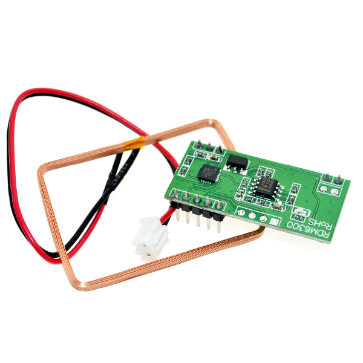
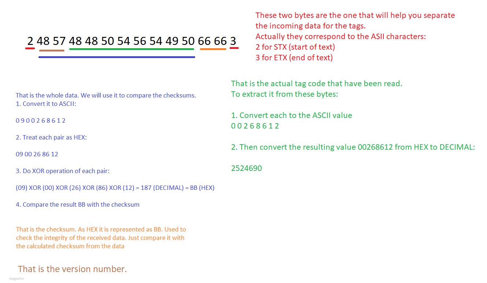

# RDM6300
Arduino library for the RDM6300 125kHZ RFID reader



##### Example:

```c++
#include <Arduino.h>
#include <SerialPrintF.h>
#include "RDM6300.h"

#define SERIAL_BAUD_RATE 9600
#define RDM6300_TX_PIN 10
#define RDM6300_RX_PIN 11

RDM6300 rdm6300(RDM6300_TX_PIN, RDM6300_RX_PIN);

void setup() {
    Serial.begin(SERIAL_BAUD_RATE);
}

void loop() {

    RFIDTag rfidTag = rdm6300.readTag();

    serial_printf(Serial, "Version: %l, Id: %l, Checksum: %s, Read Timed Out: %s\n",
                  rfidTag.version,
                  rfidTag.id,
                  rfidTag.isChecksumValid ? "true": "false",
                  rfidTag.isReadTimedOut ? "true": "false");
}

```

You need the following files:
- `src/RDM6300.h` & `src/RDM6300.cpp`
- `src/GenericUtils.h` & `src/GenericUtils.cpp`
- `src/SerialUtils.h`

Initialization:

`RDM6300 rdm6300(txPin, rxPin)` which will return you a class with operation onto the reader

`readTag()` which will block until a tag is read

`readTag(readTimeoutMS)` which will block until the given milliseconds and if tag is not read, then the `isReadTimedOut` field will be `true`

##### Features:

- Timeouts
- Documentation

#### Communication Notes:

Here is a little example that I drawn to express how to handle the data. That doesn't concerns the end user.



##### Resources:

- [RDM 6300 Data Sheet](https://www.openimpulse.com/blog/wp-content/uploads/wpsc/downloadables/RDM630-Spec.pdf)
- [RFID Wiki](https://en.wikipedia.org/wiki/Radio-frequency_identification)
